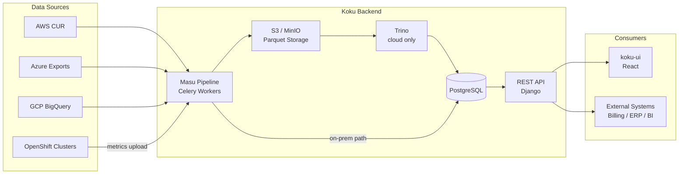
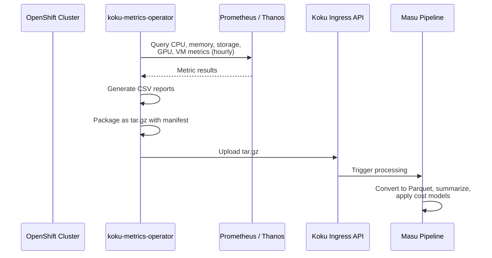
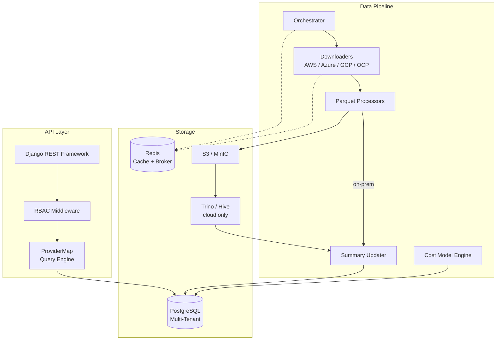

# Architecture

This page describes the high-level architecture of the Koku platform, the data
flow from metering to reporting, and the responsibilities of each component.

## High-Level Data Flow

Cloud providers send billing data (AWS CUR, Azure exports, GCP BigQuery) to
the **Masu pipeline**. OpenShift clusters upload Prometheus-based metrics via
the **koku-metrics-operator**. The pipeline converts everything to Parquet,
stores it in S3/MinIO, and aggregates it through Trino (cloud) or directly in
PostgreSQL (on-prem). The **REST API** serves cost and usage data to the
**koku-ui** frontend and any external system.

## OpenShift Metering Flow

The **koku-metrics-operator** runs on each monitored OpenShift cluster. Every
upload cycle it queries Prometheus/Thanos for node, pod, storage, GPU, and VM
metrics, packages the results as CSV files in a tar.gz archive, and uploads
them to the Koku ingress endpoint.

## Component Overview

### Component Responsibilities

| Component | Purpose |
|-----------|---------|
| **Django REST Framework** | HTTP API for reports, tags, resource types, forecasts, cost models, sources |
| **RBAC Middleware** | Tenant isolation and fine-grained access control via `x-rh-identity` header |
| **ProviderMap** | Maps query parameters to database columns and SQL fragments per provider |
| **Orchestrator** | Celery beat task that polls providers and starts manifest processing |
| **Downloaders** | Provider-specific modules that fetch billing data (CUR, exports, BigQuery, tar.gz) |
| **Parquet Processors** | Convert raw data to Parquet format and upload to S3/MinIO |
| **Summary Updater** | Aggregates Parquet data (via Trino or PostgreSQL) into summary tables |
| **Cost Model Engine** | Applies tiered rates, tag rates, markup, and distribution to OpenShift usage |
| **PostgreSQL** | Multi-tenant database (schema-per-tenant via `django-tenants`) |
| **Redis** | Celery broker, result backend, RBAC cache, and API cache |
| **S3 / MinIO** | Object storage for Parquet files |
| **Trino / Hive** | Distributed SQL engine for heavy aggregation (cloud deployment only) |
