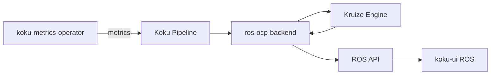

# ros-ocp-backend

[GitHub](https://github.com/project-koku/ros-ocp-backend)

The Resource Optimization Service (ROS) backend for OpenShift provides
rightsizing recommendations for containers, deployments, and jobs. It
integrates with [Kruize](https://github.com/kruize/autotune) as the
optimization engine.

## What It Does

ROS analyzes resource usage data collected by the
[koku-metrics-operator](../koku-metrics-operator/) and produces
recommendations to help teams right-size their workloads:

- **Cost-optimized** recommendations minimize resource spend
- **Performance-optimized** recommendations ensure workloads have sufficient
  headroom

Recommendations cover CPU and memory requests and limits for containers.

## Architecture

ROS sits alongside Koku and shares the same metering data pipeline:

The ROS backend aggregates data, sends it to Kruize for analysis, and exposes
the resulting recommendations through its own API — which the ROS UI in
koku-ui consumes.

## Further Reading

- [GitHub Wiki](https://github.com/project-koku/ros-ocp-backend/wiki) —
  Architecture and development setup
- [Kruize (Autotune)](https://github.com/kruize/autotune) — The optimization
  engine behind ROS
