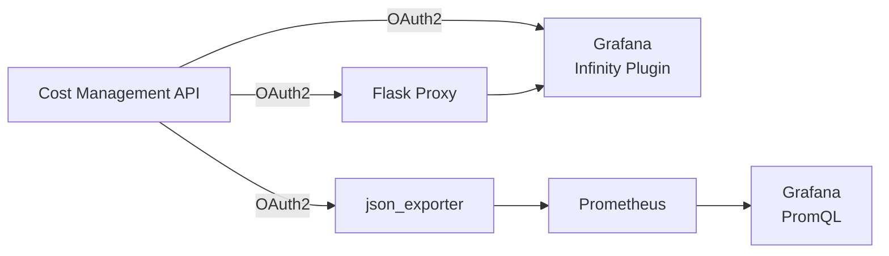

# Grafana Dashboards

Visualize OpenShift cost data from the Koku API directly in
[Grafana](https://grafana.com/) using pre-built dashboard templates.

**Source code:**
[grafana-dashboard-sample](https://github.com/project-koku/grafana-dashboard-sample)

## Overview

Three dashboard variants show **daily OpenShift cost per project**, sourced from
the Cost Management report API. Each variant handles authentication and data
transformation differently — pick the one that fits your infrastructure.



## Dashboard Variants

| Variant | Complexity | Dependencies | Best For |
|---|---|---|---|
| **Native (JSONata)** | Low | Grafana + Infinity plugin | Quick setup, minimal infrastructure |
| **Flask Proxy** | Medium | Grafana + Infinity + Python/Flask | Network-restricted Grafana instances |
| **json_exporter + Prometheus** | Higher | json_exporter + Prometheus + Grafana | Existing Prometheus stack, alerting |

## Variant 1: Native (JSONata) — Simplest

Grafana queries the Cost Management API **directly** via the Infinity
datasource. A JSONata expression flattens the nested API response into rows:

```
$.data.projects.values.{"date": date, "project": project, "cost": cost.total.value}
```

The Grafana time picker drives the API `start_date` / `end_date` parameters.

**Setup:**
```bash
cd dashboard_native
export COSTMGMT_CLIENT_ID="your-client-id"
export COSTMGMT_CLIENT_SECRET="your-client-secret"
bash import_dashboard.sh
```

**Requires:** Grafana + Infinity plugin v3.x. Nothing else.

## Variant 2: Flask Proxy

A small Python server handles OAuth2 authentication and returns a pre-flattened
JSON array. Useful when Grafana cannot reach the Cost Management API directly
(network restrictions, firewall rules).

**Setup:**
```bash
cd dashboard_with_proxy
pip3 install flask requests
export COSTMGMT_CLIENT_ID="your-client-id"
export COSTMGMT_CLIENT_SECRET="your-client-secret"
nohup python3 cost_proxy.py > /tmp/cost_proxy.log 2>&1 &
bash import_dashboard.sh
```

**Requires:** Grafana + Infinity plugin, Python 3.8+ with `flask` and
`requests`.

## Variant 3: json_exporter + Prometheus

Cost data is scraped by
[json_exporter](https://github.com/prometheus-community/json_exporter), stored
in Prometheus, and queried via PromQL. This variant enables **alerting** and
**historical data retention** beyond the API's 90-day window.

**Setup:**
```bash
cd dashboard_with_json_exporter
export COSTMGMT_CLIENT_ID="your-client-id"
export COSTMGMT_CLIENT_SECRET="your-client-secret"
envsubst < json_exporter_config.yml > /tmp/json_exporter_config.yml
json_exporter --config.file=/tmp/json_exporter_config.yml &
# Add prometheus_scrape.yml to your prometheus.yml, reload Prometheus
bash import_dashboard.sh
```

**Requires:** json_exporter v0.7+, Prometheus, Grafana. No Infinity plugin
needed.


The json_exporter variant's time range is fixed at 30 days. The Grafana time
picker does not affect it — Prometheus scrapes on a fixed schedule. Give it
several days to build a meaningful trend line.


## Feature Comparison

| Feature | Native | Proxy | json_exporter |
|---|---|---|---|
| Grafana time picker controls range | Yes | Yes | No (fixed 30d) |
| External dependencies | None | Python + Flask | json_exporter + Prometheus |
| Data persistence | None (live calls) | None (live calls) | Prometheus TSDB |
| Historical data beyond API range | No | No | Yes |
| PromQL alerting | No | No | Yes |
| Works if Grafana can't reach API | No | Yes | Yes |

## Prerequisites

- A **Red Hat service account** with access to Cost Management
- Service account **Client ID** and **Client Secret** (from
  [console.redhat.com/iam/service-accounts](https://console.redhat.com/iam/service-accounts))

Credentials are never stored in `dashboard.json` files. All variants read from
environment variables, falling back to placeholder values in the config files.

## API Endpoint Used

All variants query the same Koku endpoint:

```
GET /api/cost-management/v1/reports/openshift/costs/
  ?filter[resolution]=daily
  &filter[time_scope_value]=-30
  &group_by[project]=*
```

The response is a nested tree: `data[] → projects[] → values[] →
cost.total.value`. Each variant handles flattening differently.

## Troubleshooting

| Symptom | Cause | Fix |
|---|---|---|
| "URL not allowed" in Grafana | Missing allowed hosts in Infinity datasource | Re-run `import_dashboard.sh` |
| Chart blank with narrow time range | Only 1 data point per series | Widen time picker to ≥ 2 days |
| 401 from API | Wrong credentials | Check `COSTMGMT_CLIENT_ID` / `COSTMGMT_CLIENT_SECRET` |
| All costs are $0 | No cost model assigned | Assign a cost model with rates in Cost Management |
| json_exporter: "No data" | Prometheus hasn't scraped yet | Wait 15 min, check `/targets` |

## Extending

The sample dashboards show OpenShift costs grouped by project. To add panels for
AWS, Azure, or GCP:

1. Add a new Infinity datasource query pointing to the appropriate report
   endpoint (e.g., `/reports/aws/costs/`)
2. Adjust the JSONata expression or proxy logic for the provider's response
   structure
3. Add new dashboard panels with the desired grouping

## Further Reading

- [grafana-dashboard-sample README](https://github.com/project-koku/grafana-dashboard-sample#readme)
  — Full setup instructions for each variant
- [Infinity Plugin Documentation](https://grafana.com/docs/plugins/yesoreyeram-infinity-datasource/latest/)
  — Grafana Infinity datasource reference
