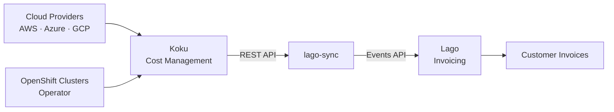

# Lago Billing Integration

[Lago](https://www.getlago.com/) is an open-source, API-first billing
infrastructure platform. This integration syncs cost data from the Koku REST API
to Lago, enabling service providers to generate itemized invoices for their
customers based on actual cloud and OpenShift resource consumption.

**Source code:**
[lago-integration-sample](https://github.com/pgarciaq/lago-integration-sample)

## Use Case

A service provider hosts infrastructure (cloud accounts, OpenShift clusters) on
behalf of multiple customers. Koku aggregates the costs; this integration routes
each customer's share to Lago for automatic invoice generation.



## How It Works

1. **Koku processes billing data** from cloud providers and OpenShift operators
   into its PostgreSQL/Trino summary tables
2. **lago-sync** fetches daily cost reports from the Koku API with dimensional
   grouping (account, service, project, cluster, etc.)
3. For each cost line item, **customer filters** determine which customer is
   billed (based on account IDs, namespace patterns, tags, etc.)
4. Matched costs are pushed to Lago as **usage events** with deterministic
   transaction IDs for deduplication
5. Lago aggregates events per billing period and **generates itemized invoices**
   with per-dimension line items

## Data Mapping

| Koku Concept | Lago Entity | Description |
|---|---|---|
| Provider (aws, azure, gcp, openshift) | Billable Metric | One metric per provider, aggregates `cost_amount` |
| Daily cost for a dimension combination | Event | One event per leaf per day per customer |
| Customer's resources for a provider | Subscription | Links customer to the billing plan |
| group_by dimensions (account, project, etc.) | `pricing_group_keys` | Produces per-dimension invoice line items |
| cost.total.value | `cost_amount` property | The billable amount (pass-through at 1:1) |

## Invoice Itemization

Charges are configured with `pricing_group_keys` so that each unique combination
of dimensions becomes a separate invoice line item:

**OpenShift invoice** (grouped by project + cluster):
```
OCP Daily Cost (project=frontend, cluster=prod-01)  .... $  420.00
OCP Daily Cost (project=backend, cluster=prod-01)   .... $  890.00
OCP Daily Cost (project=monitoring, cluster=prod-01) ... $  150.00
OCP Daily Overhead (project=frontend, cluster=prod-01).. $   63.00
────────────────────────────────────────────────────────────────────
Total                                                    $1,523.00
```

**AWS invoice** (grouped by account + service):
```
AWS Daily Cost (account=123456789012, service=AmazonEC2)  $2,340.00
AWS Daily Cost (account=123456789012, service=AmazonS3)   $   89.50
AWS Daily Cost (account=123456789012, service=AmazonRDS)  $  620.00
────────────────────────────────────────────────────────────────────
Total                                                     $3,049.50
```

Grouping dimensions are configurable per provider.

## Customer-to-Resource Mapping

Each customer in the configuration defines which Koku resources they own via
filters that match against the report API's dimensional data:

```yaml
customers:
  - external_id: "customer_acme"
    name: "Acme Corp"
    currency: "USD"
    tax_identification_number: "US12-3456789"
    address:
      country: "US"
      state: "CA"
      zipcode: "94105"
    resources:
      - provider: aws
        filter:
          account: ["123456789012", "234567890123"]
      - provider: openshift
        filter:
          project: ["acme-*"]
          cluster: ["prod-cluster-01"]
```

Filter values support glob patterns (`*` and `?`), enabling flexible matching
like `acme-*` for all namespaces starting with "acme-".

### Supported Filter Dimensions

| Provider | Dimensions |
|---|---|
| AWS | `account`, `service`, `region`, `tag:<key>` |
| Azure | `subscription_guid`, `service_name`, `resource_location`, `tag:<key>` |
| GCP | `account`, `service`, `region`, `tag:<key>` |
| OpenShift | `cluster`, `project`, `node`, `vm_name`, `tag:<key>` |

## Koku API Usage

The integration calls the Koku report API endpoints:

| Endpoint | Purpose |
|---|---|
| `GET /api/cost-management/v1/reports/aws/costs/` | AWS costs |
| `GET /api/cost-management/v1/reports/azure/costs/` | Azure costs |
| `GET /api/cost-management/v1/reports/gcp/costs/` | GCP costs |
| `GET /api/cost-management/v1/reports/openshift/costs/` | OpenShift costs |

Key parameters used:

| Parameter | Value | Purpose |
|---|---|---|
| `filter[resolution]` | `daily` | One data point per day |
| `filter[start_date]` | `YYYY-MM-DD` | Start of range |
| `filter[end_date]` | `YYYY-MM-DD` | End of range |
| `cost_type` | `calculated_amortized_cost` (AWS only) | Amortized RI/SP costs |
| `group_by[<dimension>]` | `*` | Group results by dimension |

The response is a nested JSON tree grouped by the requested dimensions. The
integration walks this tree recursively to reach leaf cost values.

### AWS Cost Type

For AWS, the integration uses `cost_type=calculated_amortized_cost`. This
spreads Reserved Instance upfront payments and Savings Plan discounts across
the reservation period, giving the true economic cost per day rather than
cash-flow timing.

### OpenShift Cost Breakdown

OpenShift costs include both direct costs and distributed overhead:

| Cost Field | Meaning |
|---|---|
| `cost.raw` | Base infrastructure cost |
| `cost.markup` | Markup from cost models |
| `cost.usage` | Usage-based cost model rates |
| `cost.total` | Sum of all above |
| `cost.platform_distributed` | Platform overhead allocated to project |
| `cost.worker_unallocated_distributed` | Unallocated worker cost distributed |

The integration generates separate events for direct costs and overhead,
allowing them to appear as distinct line items on invoices.

## Taxes

The integration pushes pre-tax cost amounts to Lago. Tax calculation is handled
entirely by Lago based on customer configuration.

### Tax Options

| Option | Best For | How It Works |
|---|---|---|
| **Manual rates** | Fixed rate, few jurisdictions | Create tax objects in Lago, assign per customer via `tax_codes` |
| **Lago EU Taxes** | EU B2B with reverse charge | Auto-detects VAT rate from customer country + VAT ID (VIES validated) |
| **Avalara** | US multi-state, global compliance | Full tax engine — calculates per line item based on addresses |
| **Anrok** | US + international, audit trail | Similar to Avalara, alternative provider |

### Tax Hierarchy in Lago

```
Billing Entity default tax
  → overridden by Customer tax_codes
    → overridden by Plan-level tax
      → overridden by Charge-level tax
        → overridden by Tax provider (Avalara/Anrok)
```

Customer address and `tax_identification_number` are provisioned during
bootstrap from `config.yaml`, enabling Lago's tax engine to calculate correctly.

## Reliability Features

| Feature | Implementation |
|---|---|
| **Idempotent sync** | Deterministic `transaction_id` per event; Lago deduplicates |
| **State tracking** | SQLite database records what has been synced |
| **Retry with backoff** | Transient errors (429, 5xx, timeouts) retried 3× with exponential backoff |
| **Partial failure handling** | Failed batches don't block remaining batches; errors reported |
| **Reconciliation** | Cross-system comparison of Koku totals vs Lago usage |
| **Dry-run mode** | Preview events without pushing (`--dry-run`) |
| **Config validation** | Actionable error messages for malformed configuration |

## Quick Start

### Prerequisites

- Python 3.11+
- A running Koku instance with processed cost data
- A running Lago instance (self-hosted or cloud)

### Install and Configure

```bash
git clone https://github.com/pgarciaq/lago-integration-sample.git
cd lago-integration-sample
pip install -e ".[dev]"
cp config.example.yaml config.yaml
# Edit config.yaml with your credentials and customer definitions
```

### Bootstrap Lago Entities

Creates billable metrics, plan, charges, customers, and subscriptions:

```bash
lago-sync bootstrap
```

### Sync Cost Data

```bash
# Preview first (no data pushed)
lago-sync sync --month 2024-01 --dry-run

# Sync a month
lago-sync sync --month 2024-01

# Daily sync (default: yesterday)
lago-sync sync
```

### Reconcile

Compare Koku totals against Lago usage before finalizing invoices:

```bash
lago-sync reconcile --month 2024-01
```

## Scheduling

For production use, schedule syncs via cron:

```bash
# Daily: sync yesterday's data at 6 AM
0 6 * * * cd /path/to/lago-integration-sample && lago-sync sync

# Monthly: full re-sync on the 3rd (after cloud providers finalize data)
0 8 3 * * cd /path/to/lago-integration-sample && lago-sync sync --month $(date -d "last month" +\%Y-\%m) --force
```

## Architecture

```mermaid
graph TD
    subgraph "lago-sync"
        CONFIG[config.yaml<br/>Customer → Resource mapping]
        KOKU_CLIENT[koku_client.py<br/>Fetches report data]
        LAGO_SYNC[lago_sync.py<br/>Routes costs to customers]
        BOOTSTRAP[bootstrap.py<br/>Provisions Lago entities]
        STATE[state.py<br/>SQLite sync tracking]
        RECONCILE[reconcile.py<br/>Cross-system verification]
    end

    subgraph "Koku"
        API[Report API<br/>/reports/{provider}/costs/]
    end

    subgraph "Lago"
        EVENTS[Events API<br/>/api/v1/events/batch]
        INVOICES[Invoice Engine]
    end

    CONFIG --> KOKU_CLIENT
    CONFIG --> LAGO_SYNC
    KOKU_CLIENT --> API
    API --> KOKU_CLIENT
    LAGO_SYNC --> EVENTS
    EVENTS --> INVOICES
    STATE --> LAGO_SYNC
```

## Limitations

- **Batch, not real-time** — Designed for daily or monthly sync cycles, not
  streaming.
- **Credits/refunds** — Not handled by the integration. Use Lago's credit note
  feature for adjustments.
- **Currency conversion** — Koku reports in USD. Multi-currency customers
  require exchange rate configuration in Lago.
- **Data latency** — Cost data appears in Koku 24–48 hours after usage. End-of-
  month data may continue reprocessing for 2–3 days into the next month.

## Further Reading

- [lago-integration-sample README](https://github.com/pgarciaq/lago-integration-sample#readme)
  — Full configuration reference, troubleshooting, and FAQ
- [Lago Documentation](https://docs.getlago.com/) — Lago platform docs
- [Koku API Reference](https://github.com/project-koku/koku/blob/main/docs/specs/openapi/openapi.json)
  — OpenAPI specification for the Koku REST API
